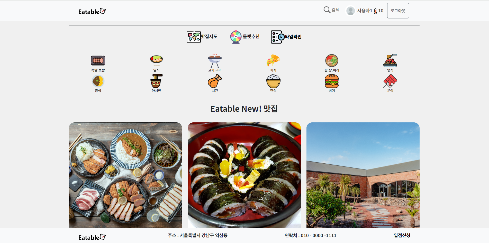

## **Eatable 소개**

Eatable은 **식당을 보다 편리하게 이용할 수 있게 하기 위한 웹사이트**입니다.

Eatable은 업체 등록 간소화 쉬운 사용  - 포스기나 별도 절차 설치없이 모바일이나 테블릿 , pc 로 실시간  고객  웨이팅 처리를 할 수 있게 합니다.  또한 간편하고 재미있는 웨이팅 실시간 공유되는 타임라인과 
사용자 온도시스템을 만들어  사용자의 적극적인 정보 공유를 합니다.

## 😀**팀원 소개**

|팀원|역할|
|------|---|
|송민호|스프링부트  JPA , JWT 구현 |
||  타임라인 구현|
|김미란|로그인, 회원가입 , 회원마이페이지|
||온도 콘텐츠 구현|
|임승빈|어드민 데이터 차트.js 시각화, 상태값 데이터 관리 구현|
||네이버OAuth2로그인 구현|
|조재환|실시간 웨이팅 및 대기열 구현|
||음식점 디테일 시각화 구현|
|최진무|룰렛 , 구글맵API 구현|
||업체등록 CRUD , 검색서치 쿼리 구현|

## 🛠**기술 스텍**

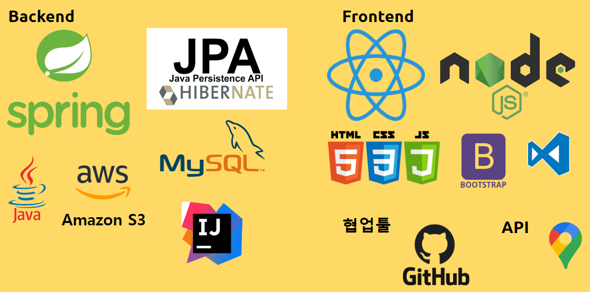
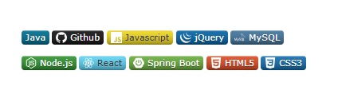

## 📆**개발 기간**

**2024.01.26 ~ 2024.02.26(총 4.5주)**

|주차 |구분 |활동|
|:----:|:----:|:----|
|1주차|사전기획   |  프로젝트 주제 선정 및 기획안 작성  | 
|2주차|데이터 수집   |  Google Map / EmailJs / ChartJs / JWT /Websocket|
|3주차|기능구현 및 모델링   |  웹 서비스 시스템 설계 및 기능 구현, 기본 스타일 작성  |  
|4주차|서비스 구축   |  기본  CSS 작성,최적화, 오류 수정  |  

## 🔄**시스템 설계**

**Spring Boot 설정**: Spring Data JPA를 사용하여 데이터베이스와 상호 작용.

**Entity 클래스 작성**: MySQL 데이터베이스의 테이블에 대응하는 Java 클래스를 만듦.

**Repository 인터페이스 작성**: 각 엔티티에 대한 Repository 인터페이스를 만들어서 데이터베이스와의 상호 작용을 담당.

**Controller 및 Business Logic**: Spring MVC 패턴을 따르는 컨트롤러를 만들어서 클라이언트의 요청을 처리하고, 비즈니스 로직을 실행

**React 프론트엔드 개발**: React를 사용해서 웹 클라이언트를 만들고 백엔드로부터 데이터를 받아와서 사용자에게 보여줌.

**REST API 구현**: Spring Boot 애플리케이션에서 RESTful 웹 서비스를 구현해서 클라이언트와 통신.

## ❤**서비스 기능 소개**

#### [ 로그인 / JWT ]
##### < 로그인 >
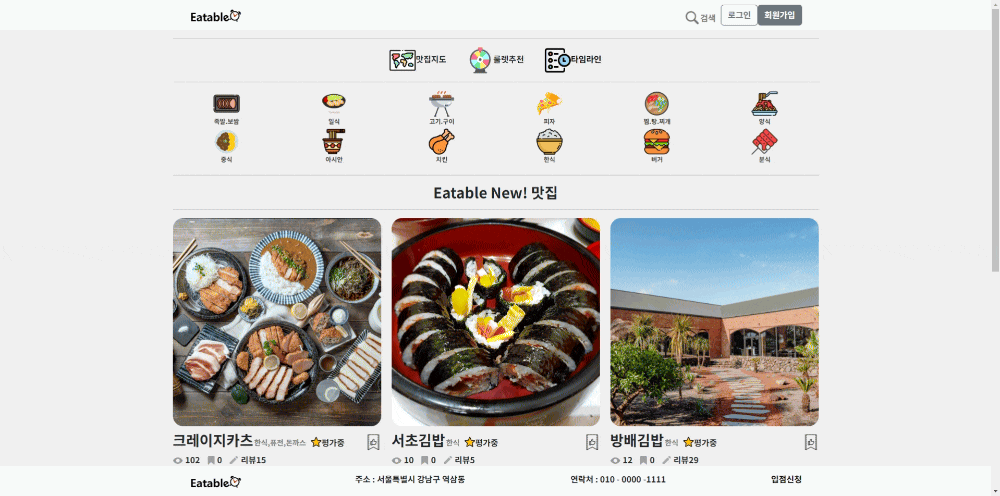

##### < JWT >
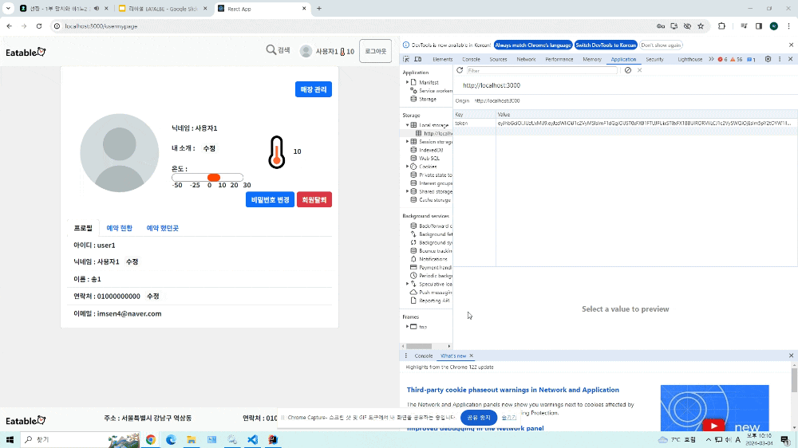
---

#### [ 마이페이지 ]

---

#### [ 관리자페이지 ]
##### < 신청리스트 >
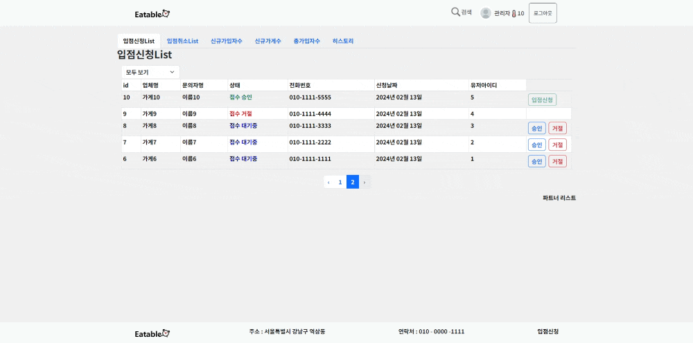

##### < 취소리스트 >
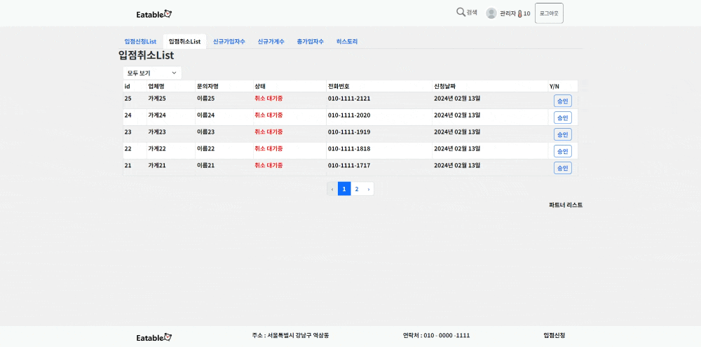

##### < 차트 >

##### < 히스토리 >

---

##### [ 메뉴디테일 ]

---

#### [ 예약,대기열 ]

---

#### [ 파트너 ]
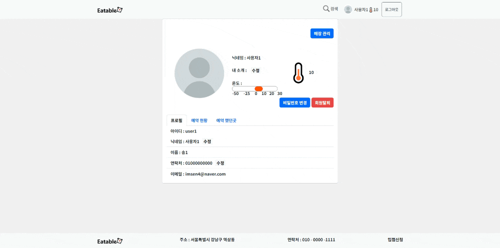
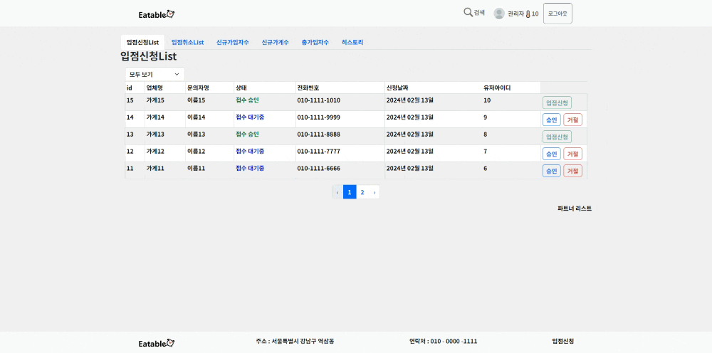
---

#### [ 룰렛 ]

---

#### [ 구글맵 ]
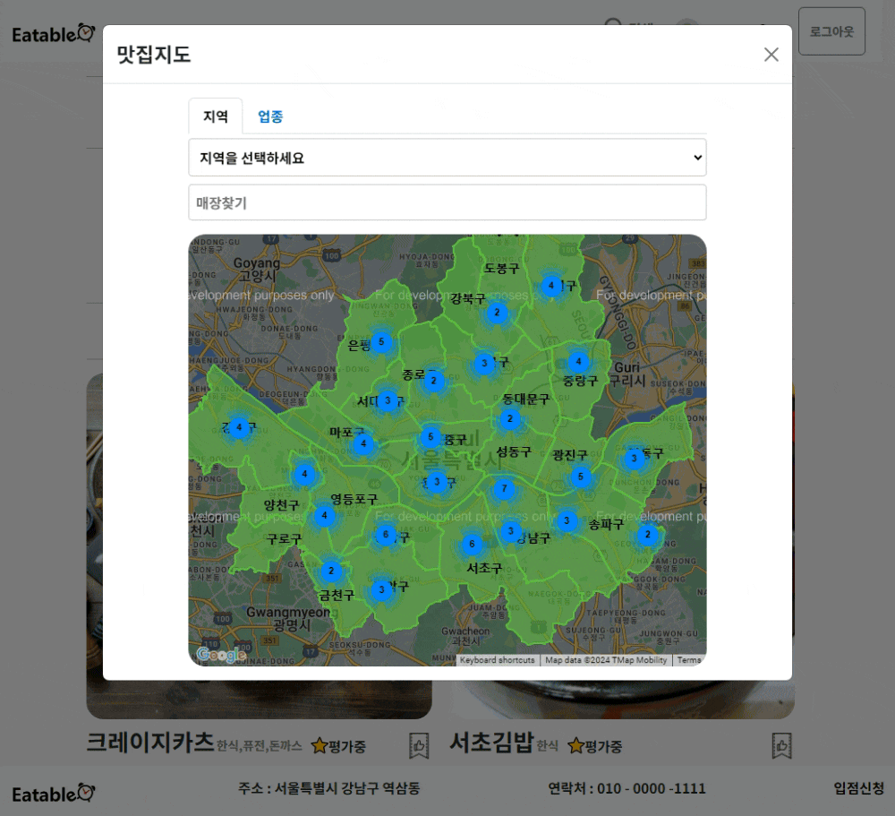
---

#### [ 타임라인 ]
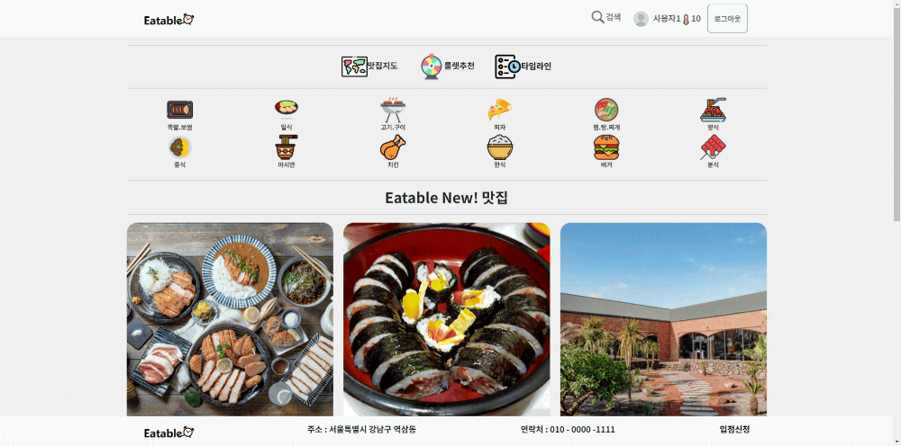
---
